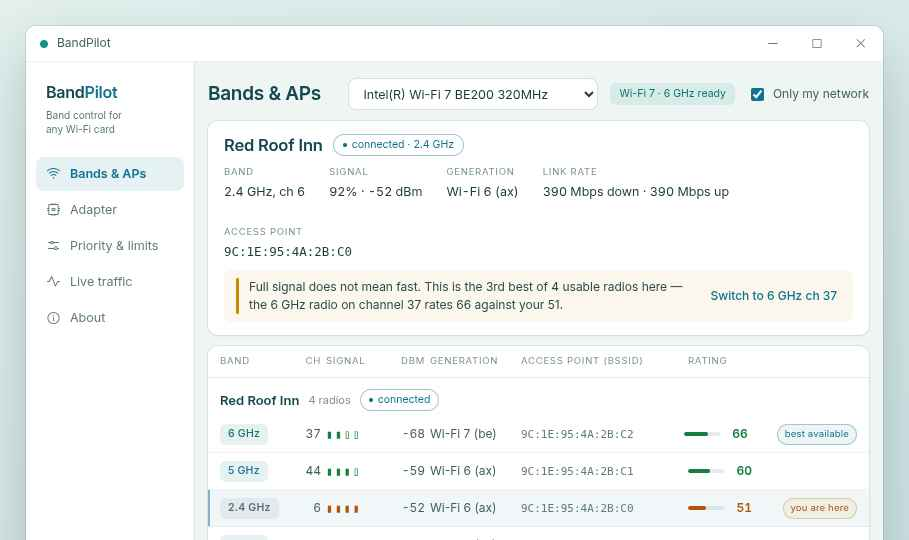

# BandPilot

**Choose which Wi-Fi band and which access point you connect to.**

Windows hides the single most useful Wi-Fi decision from you. On a hotel, campus, office or apartment network, one name like `Red Roof Inn` is not one radio — it is a 2.4 GHz radio, a 5 GHz radio and often a 6 GHz radio, on *every* access point in the building. Windows silently picks one, frequently a congested 2.4 GHz radio two floors away, and offers no way to see which one you got or to change it.

BandPilot shows you every radio separately and connects you to the one you pick.



---

## Why this exists

Intel's Killer Performance Suite has this feature, but it refuses to install unless it finds a Killer-branded adapter. The BE200 series is Intel's own Wi-Fi 7 silicon and is *not* Killer-branded, so the suite ignores it.

BandPilot is an independent, open-source reimplementation of the parts that matter, written from scratch against public Windows APIs. It shares no code with Intel's software.

---

## Works with any card

Nothing in BandPilot is written for one vendor. It asks the driver what the card can do and adapts:

- **Wi-Fi generation** and **6 GHz support**, from `WlanGetInterfaceCapability`
- **Whether the driver will accept a preferred access point at all** — `dwMaxDesiredBssidListSize`. A driver reporting `0` cannot be pinned to a specific radio no matter what the UI offers, so BandPilot says so plainly instead of showing a button that quietly does nothing.

Intel AX200/AX201/AX210/AX211 and BE200/BE201/BE202, plus the Realtek, MediaTek and Qualcomm radios in mainstream laptops, all go down the same code path. There is no per-vendor branch and no model-string matching anywhere in the project — an earlier version matched Intel model names and picked the wrong adapter on every card that was not on the list.

**On 6 GHz detection:** Wi-Fi 7 hardware is taken as 6 GHz capable. For Wi-Fi 6 cards the only trustworthy evidence is having *seen* a 6 GHz BSS, because scan results come from the card itself — so a 6E card proves itself the moment a 6 GHz AP is in range. Until then the state is reported as *unknown*, not *unsupported*: an absence of 6 GHz networks nearby looks identical to a card that cannot use them, and wrongly greying out 6 GHz on a capable AX211 is the worse error.

---

## Features

### Bands & APs — the main event
Every BSS (one entry per AP radio) grouped by network, showing band, channel, signal, Wi-Fi generation and BSSID. Pick one, click connect, and you are pinned to that exact radio.

The **Rating** column is throughput potential, not signal strength — signal, plus channel width and free airtime, scaled down as the signal weakens so an unreachable radio scores nothing.

Width and busyness are read from each access point's own beacon. Windows hands you that data as an opaque blob and exposes nothing from it, but it holds the two numbers that matter most after signal. The **BUSY** column is the AP's own measurement of how much of the time its channel is occupied — the most honest congestion figure available anywhere, because it counts airtime lost to hidden nodes, interference and slow legacy clients, none of which a signal reading can detect. Plenty of consumer routers never send it, so absence reads as *unknown* rather than as zero.

The consequence worth knowing: **wider is not better when busy.** An 80 MHz channel only transmits when all four of its 20 MHz subchannels are clear, so a congested 320 MHz radio deservedly loses to a quiet 80 MHz one.

When you are on a lower-ranked radio than one available, the banner says so in plain words and offers a one-click switch. That contradiction — full signal bars on the third-best radio in the building — is the whole argument for the app.

### Adapter
The driver's own radio settings, read live from the installed driver. Nothing is hardcoded to a driver revision, because the available keywords and accepted values genuinely differ between drivers and vendors for the same card. Use this to stop Windows wandering back to 2.4 GHz an hour after you pin.

### Priority & limits
Per-application traffic prioritisation and bandwidth caps, implemented as standard Windows QoS policies written straight to the registry — so they work on Home editions, which have no `gpedit.msc`. DSCP is presented as a ranked 1–7 scale rather than raw numbers, because DSCP `8` is *lower* priority than `0` and reads as a mistake otherwise.

### Game mode
Eases background apps off the CPU and memory so an updater cannot steal them mid-match, and reverses everything when the game exits.

It is **interruption suppression, not a frame-rate booster** — measured gains from tools of this kind are low single digits and frequently zero. It is worth being blunt about that, because the category is full of software that promises otherwise.

It never stops a Windows service. That is the highest-consequence, lowest-payoff thing these tools do: half the plausible targets are trigger-started and simply come back, stopping the wrong one leaves a visibly broken machine, and stopping `WlanSvc` would break BandPilot itself.

The safety property is structural rather than procedural. Nearly everything it does is a job object or per-process throttling state that the kernel destroys when BandPilot's process ends — on a clean exit, a crash, or a kill. Exactly two changes survive a reboot (a machine-wide registry value and the active power scheme); those are written to a journal *before* they are applied and replayed on next launch if the session ended badly. Your own power plans are never edited — a private copy is made and deleted afterwards.

```powershell
BandPilot.exe --restore
```
replays that journal headlessly, so a stuck machine has a one-line fix without the GUI.

### Live traffic
Per-process upload and download rates via an ETW kernel session. Windows exposes no per-process network performance counter, so listening to kernel TCP/IP events is the only way to attribute bytes to a PID. Select a process and jump straight to creating a priority rule for it.

---

## Install

### Option A — download the release
Grab `BandPilot.exe` from the [Releases](../../releases) page. It is a single self-contained file with no prerequisites; the .NET runtime is bundled.

Right-click ▸ **Run as administrator**.

> Windows SmartScreen will warn about an unsigned executable from an unknown publisher. That is expected for an unsigned open-source binary. Click **More info ▸ Run anyway**, or build it yourself from source below.

### Option B — build from source
Needs the [.NET 8 SDK](https://dotnet.microsoft.com/download/dotnet/8.0).

```powershell
git clone https://github.com/wrstt/BandPilot.git
cd BandPilot
.\build.ps1
```

The binary lands in `dist\BandPilot.exe`.

---

## Requirements

- Windows 10 or 11, 64-bit
- Any Wi-Fi adapter Windows supports
- Administrator rights — required to pin a BSSID, write QoS policy, and open an ETW session
- The network must already be saved in Windows, since BandPilot reuses the stored credentials rather than asking for them

---

## How to use it

1. Connect to the network normally through Windows once, so the password is saved.
2. Open BandPilot as administrator. It preselects the most capable adapter if you have more than one radio.
3. **Bands & APs** opens with *Only my network* already ticked, which cuts a forty-row list to the three or four radios you can actually choose between.
4. The `you are here` chip marks your current radio; `best available` marks the one worth moving to.
5. Pick a row and click **Connect to this access point** — or just click the **Switch to…** button in the banner.
6. If Windows drifts back later, open **Adapter** and lower *Roaming Aggressiveness*.

---

## Caveats worth knowing

**Pinning is per-connection, not permanent.** It survives until the adapter roams, the radio resets, or you reconnect. The Adapter page settings are the standing preferences that make it stick.

**Your driver has the final say.** `WlanConnect` with a desired-BSSID list is a strong constraint, but some drivers treat it as a hint and will still roam under a weak signal. This is driver behaviour, not something an application can override.

**QoS priority needs two things you might not have.** Windows ignores DSCP policies on non-domain-joined PCs until a registry switch is set — use *Enable QoS marking* in the sidebar, then restart. Beyond that, DSCP marks only help end-to-end if your router honours them; many consumer routers ignore or strip them. Bandwidth *limits* apply locally and work regardless.

**6 GHz needs everything to agree.** Your card, driver, router and regulatory region all have to support 6 GHz for those radios to appear at all.

---

## Project layout

```
src/
  Native/WlanApi.cs        P/Invoke for wlanapi.dll (structs, enums, entry points)
  Wifi/WifiService.cs      Scanning, BSS enumeration, BSSID-pinned connect
  Wifi/AdapterCapability.cs  What the driver says the card can do
  Wifi/BandTools.cs        Frequency to band/channel, rating, formatting
  Wifi/InformationElements.cs  Beacon parsing: channel width, BSS Load
  Wifi/RoamingHold.cs      Non-disruptive roaming brakes
  Game/                    Game mode, its journal and its safety rails
  Adapter/                 Driver settings via the NetAdapter PowerShell module
  Qos/QosManager.cs        Windows QoS policy read/write
  Monitor/                 ETW per-process bandwidth accounting
  Ui/                      WPF: Theme.xaml holds every token, one file per page
tests/LayoutTests/         Struct layout, band math and capability verification
tools/Show-WifiBands.ps1   No-install PowerShell band viewer
```

The UI is WPF. Everything outside `src/Ui` is UI-agnostic and was untouched by the move from WinForms.

### About the tests

A wrong struct size or field offset in the Native Wifi layer does not crash — it silently yields plausible but incorrect signal strengths, channels and BSSIDs, which is far worse than a crash. `tests/LayoutTests` asserts every size and offset against the C headers, plus the channel arithmetic, the rating weights, and the capability rules that decide whether a 6 GHz row is offered or the connect button works at all. It targets plain `net8.0`, so it runs on any OS:

```bash
cd tests/LayoutTests
dotnet run -c Release
```

This has caught two real bugs so far: structs holding `WCHAR[256]` fields defaulting to ANSI marshalling, which would have halved their size and broken every read; and a rating formula that scored a strong 2.4 GHz radio *above* a decent 6 GHz one, inverting the entire point of the tool.

---

## What this is not

BandPilot does **not** replicate DoubleShot Pro (bonding Wi-Fi and Ethernet simultaneously). That genuinely depends on proprietary Killer driver behaviour and cannot be reimplemented from user space.

---

## Not affiliated with Intel

BandPilot is independent software written against publicly documented Windows APIs. It contains no Intel code, is not derived from Intel Killer Performance Suite, and is not endorsed by or affiliated with Intel Corporation. "Killer" and "Intel" are trademarks of their respective owners, used here only to describe compatibility.

## Licence

MIT — see [LICENSE](LICENSE).
